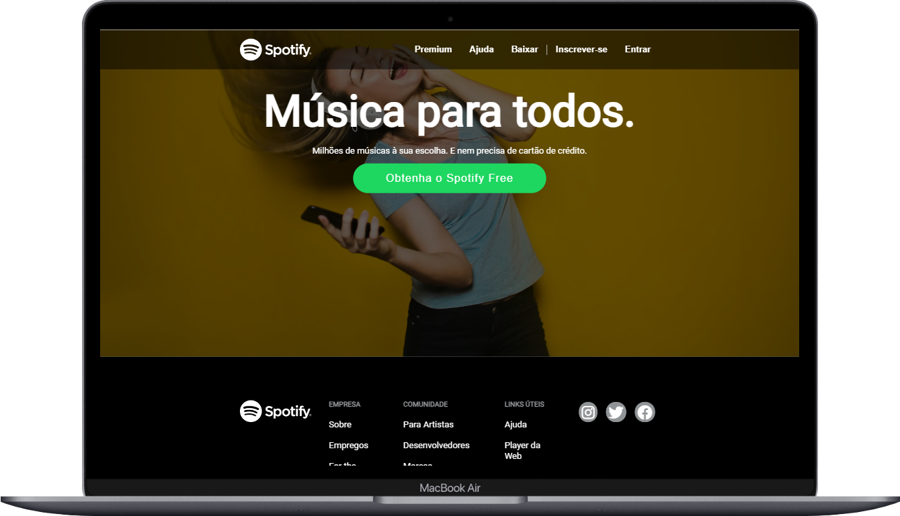

<a id='ancora'></a>
# Clone Spotify

<br>
This is a challenge by Imã Tech.

<br>

[Link do Desafio](https://spotify-ima.vercel.app/)


<br><br>

- [Sobre a Imã Tech](#ancora1) <br>
- [Sobre o Desafio](#ancora2) <br>
- [Sobre o Projeto](#ancora3) <br>
- [Requisitos Obrigatórios](#ancora4) <br>
- [Competências Desenvolvidas](#ancora5) <br>
- [Execução](#ancora6) <br>
- [Desenvolvedora](#ancora7)

<br><br>

<a id="ancora1"></a>

## Sobre a Imã Tech

<br>

<p align="center">
  
</p>

<br>

A Imã Tech promove bootcamp Sharp Coders de forma gratuíta com formação fullstack em C# e Angular, processo de gamificação, os melhores alunos tem a oportunidade de participar do processo seletivo com a empresa MXM.

<br>

<a id="ancora2"></a>

## Sobre o Desafio

<br>

Nesse desafio trabalharemos no desenvolvimento de uma página em HTML e CSS para utilizar os dados do projeto de um clone do Spotify, que é um site de música.
O projeto tem como objetivo criar uma página simples com conceitos de resposividade.
<br>

Neste projeto você terá uma visão sobre como criar Navbar, footer.

<br>

<a id="ancora3"></a>
## Sobre o Projeto

<br>

O projeto foi montado seguindo as boas práticas de Code Review, registrando toda e qualquer entrada de informação via Pull Requests, o que facilitaria a montagem de pipelines de teste de código e/ou gestão de conflitos de branchs, conforme os commits.


<br>

Para este projeto foram utilizadas as seguintes tecnologias:

<br>

* 

* 


<br>

<a id="ancora4"></a>
## Requisitos Obrigatórios

<br>

### Requisito 1
* Criar a página igual o projeto guiado.

<p align="center">
  
</p>

<br>

### Requisito 2
* Conceito de Responsividade, para isso usei o simulador de celular para fazer a média queries. Tela de tamanho: Galaxy Fold2 (884px/1104px).

    <p align="center">
    
    </p>

### Requisito 3
* Telas de Celular: Iphone 12 (428px/926px)
 <p align="center">
    
    </p>
     <p align="center">
    
    </p>

<br>

<br>

<a id="ancora5"></a>
### 
## Competências Desenvolvidas

<br>

* Git para controle e versionamento do código;
* Mobile First;
* HTML semântico;
* CSS;
* Media Queries
 

<br>

<a id="ancora6"></a>
## Execução 

<br>

1. Clone este repositório remoto em seu equipamento:
```
git clone git@github.com:Karolinegaia/Spotify-ima.git
```


2. Abra o VSCode ou IDE de sua preferência:
````
code .
````


<br>

<a id="ancora7"></a>
## Desenvolvedora

Projeto desenvolvido por:

<table align="center">
  <tr>
    <td align="center">
      <a target="_blank" href="https://www.linkedin.com/in/karoline-gaia-alexandre/">
        <br>
        <sub>
          <b>Karoline Gaia Alexandre</b><br>
           <br><p>Front-End</p>
        </sub>
      </a>
    </td>
  </tr>
</table>

<br><br>

[Voltar ao Topo](#ancora)